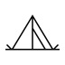
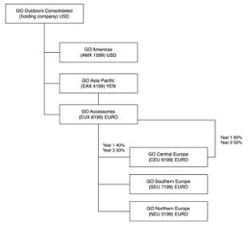

# Introduction

## Purpose

The purpose of this document is to outline the requirements for a proof-of-concept (PoC) for migrating workload and data from a traditional data warehouse to a data lakehouse architecture for Watson’s Great Outdoors Company. Watson’s Great Outdoors Company will be referred to as WGO or GO in this document.

## Scope

This PoC will focus on validating the feasibility and benefits of migrating workload and data from the existing data warehouse to a data lakehouse. The scope includes understanding data migration processes, workload adaptation, and assessing the overall performance and scalability of the proposed solution.

## Company Information

Watson's Great Outdoors is a leading provider of high-quality outdoor equipment, dedicated to enhancing outdoor experiences for adventure enthusiasts. 

With a strong emphasis on sales, we offer a diverse range of products tailored to meet the needs of outdoor enthusiasts, including Camping Equipment, Mountaineering Equipment, Personal Accessories, Outdoor Protection, and Golf Equipment. Our commitment to quality ensures that customers can trust in the durability and reliability of our products for their outdoor pursuits. At Watson's Great Outdoors, we strive to be the go-to destination for individuals seeking top-notch outdoor gear, providing unmatched service and expertise to make every outdoor adventure memorable.

**Distinct Product Collection**: GO Accessories boasts its own exclusive collection of products, setting itself apart from the other GO companies. This differentiation is achieved through unique brand identities, names, pricing strategies, color variations, and size options, offering customers a diverse and specialized range of outdoor goods.

**Single Branch Sales**: Unlike the regionally based GO companies, GO Accessories operates from a single branch. However, its reach extends beyond regional boundaries, serving customers across all regions and retailers. This strategic approach allows for a centralized point of sale while catering to a broad customer base.

**Dual Functionality**: GO Accessories functions both as an operating company based in Geneva and as a part owner of three GO subsidiaries in Europe. This dual role positions GO Accessories as a key player in the overall operations of The Sample Outdoors Company, contributing not only to its own success but also playing a significant role in the success of the European subsidiaries.

This structure reflects the versatility and strategic positioning of GO Accessories within the larger framework of Watson’s Great Outdoors Company. By offering a unique product line, operating from a centralized location, and participating in ownership stakes across regions, GO Accessories plays a pivotal role in the company's overall revenue generation and market presence.

The following diagram illustrates the consolidated corporate structure of Watson’s Great Outdoors Company. The diagram also includes the percentage changes in ownership for GO Central Europe, and the reporting currency and GL (general ledger) prefix for each subsidiary. In year 1, GO Asia Pacific owns 60% of GO Central Europe, and in year 3, its ownership decreases to 50%. In year 1, GO Accessories owns 40% of GO Central Europe, and in year 3 its ownership increases to 50%.

 

Each corporation in Watson’s Great Outdoors Company has the same departmental structure and the same general ledger (GL) structure, as shown in the following table. Divisions may not report in the same currencies. For example, the Americas subsidiary reports in US dollars, but the corporate division local currency reports in Canadian dollars, and the Operations division local currency is pesos.

|Division (GL)|Department (GL)
|-------------|---------------|
|Corporate (1700)|Sales (1720)
||Marketing (1750)
||IS&T (1760)
||Human Resources (1730)
||Finance (1740)
||Procurement (1710)
|Operations (1800)|Production and Distribution (1820)
||Customer Service (1820)

#### Table 1. Departmental structure

Each corporation has a complete chart of accounts. Most of the accounts, such as those under non-personnel expenses, are at the department level, and contain only summary amounts. For example, although each marketing department has expenses, the cost is unspecified at the transaction level where marketing promotions occur.

