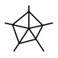

# Performance Metrics

During the proof-of-concept capture all metrics related to the performance of the queries.

* Measure and record response times for each category of queries serial and concurrency test, see the details in Table 2: Performance Tests.
* Analyze query execution plans and resource utilization during concurrency testing.
